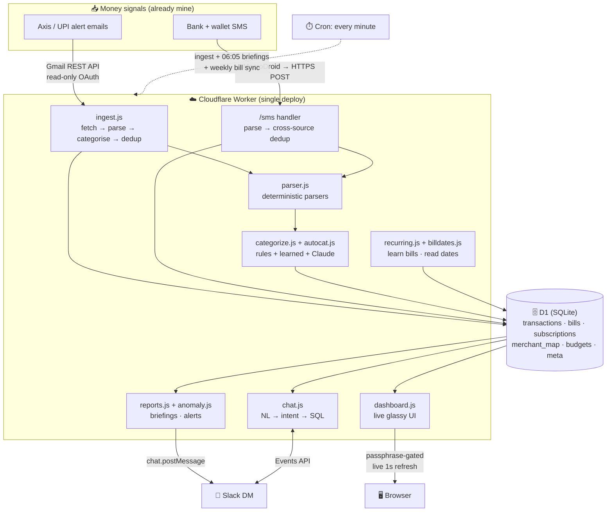
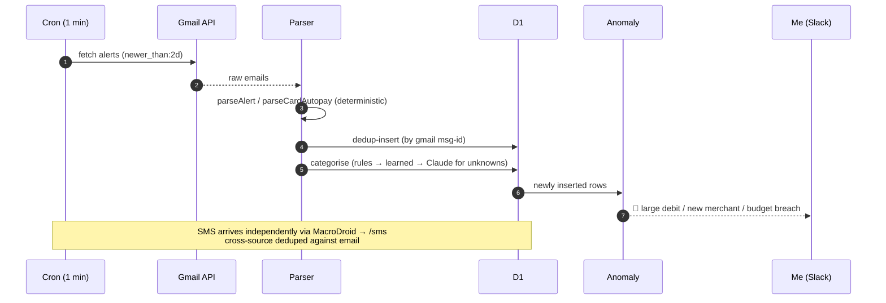

# 💸 Finance Agent

> A personal, self-hosted finance intelligence that reads my bank & UPI alerts, keeps a live ledger, learns my bills, and briefs me every morning — so I always know where my money went without ever touching a spreadsheet.

Built as a single **Cloudflare Worker + D1** database. It watches my **Axis Bank / UPI email + SMS alerts**, turns them into a clean transaction ledger, and layers intelligence on top: automatic categorisation, self-learning recurring bills, real renewal dates read from merchant emails, spend forecasting, anomaly alerts, and a live glassmorphism dashboard — plus a chat interface in Slack where I can just ask *"how much did I spend on food this month?"*

**The whole thing runs itself.** I never enter a transaction (except cash), never mark a bill paid, never categorise anything by hand. It ingests every minute, re-learns my bills weekly, and self-corrects as my spending changes.

---

## Table of contents

- [Why it exists](#why-it-exists)
- [How it helps me every day](#how-it-helps-me-every-day)
- [Architecture](#architecture)
- [The data pipeline](#the-data-pipeline)
- [Feature tour](#feature-tour)
- [The intelligence layer](#the-intelligence-layer)
- [Data model](#data-model)
- [HTTP surface](#http-surface)
- [Privacy & security model](#privacy--security-model)
- [Tech stack](#tech-stack)
- [Cost](#cost)
- [Setup](#setup)

---

## Why it exists

Every digital rupee I spend already generates a notification — an Axis Bank email, a UPI receipt, an SMS. That information is *already mine*; it's just scattered across an inbox and a messages app where it's useless for actually understanding my money.

This agent captures that stream at the source, deduplicates it, and turns it into a single source of truth I can query, visualise, and be nudged by. No manual entry, no bank-aggregator app holding my credentials, no data leaving my own infrastructure.

## How it helps me every day

| Moment | What the agent does |
|---|---|
| **Every morning** | A "yesterday's spend" briefing lands in Slack — total, biggest items, category breakdown, one-line insight. |
| **The second I pay** | The transaction appears on the dashboard within a minute (or instantly via a Refresh tap). |
| **When I wonder** | I ask in plain English — *"top merchants this month"*, *"food last 10 days"* — and get an exact answer, computed in SQL. |
| **Before a bill is due** | It reminds me — using the **real** renewal date read from the merchant's own email, not a guess. |
| **When something's off** | A large debit, a brand-new merchant, or a budget breach pings me in real time. |
| **When I plan** | The dashboard forecasts month-end spend, flags categories running hot, and totals my recurring commitments. |
| **Weekly / monthly** | Rollup reports so nothing drifts unnoticed. |

The result: I have the financial awareness of someone who obsessively tracks every rupee, with the effort of someone who does nothing.

## Architecture

One Worker does everything — HTTP (dashboard, chat webhook, admin) and scheduled cron (ingest, briefings, bill-learning). All money math is **deterministic SQL**; the language model is used **only for judgement** (categorising unknowns, identifying recurring bills, reading dates from prose, writing a one-line narrative).

### Design principles

- **Money math is never done by a model.** Every total, average, and breakdown is a SQL query. The model only *labels* and *narrates*.
- **Deterministic parsing from real samples.** Parsers were written against actual alert formats, not guessed.
- **Idempotent + deduplicated.** Gmail message-id dedup, plus cross-source dedup (amount + timestamp ±20 min + direction) so an email and its matching SMS never double-count.
- **Self-maintaining.** New subscriptions get discovered, amounts self-correct, categories are learned once and remembered forever.

## The data pipeline

Independently, the **SMS path** (Android **MacroDroid** forwards bank/wallet SMS to a signed `/sms` endpoint) captures anything email misses (e.g. card-only charges) and is cross-source-deduped against the email ledger. Cash and pre-loaded wallet-balance spends — the only things no alert reports — are logged in one tap via the dashboard's **＋ Add**.

## Feature tour

### 🔴 Live dashboard
A bold, dark, glassmorphism dashboard (passphrase-gated), refreshing itself every second via a lightweight `/pulse` heartbeat:

- **Hero KPIs** — net / spent / income for a selectable window (**7 / 30 / 60 / 100 / 365 / all days**).
- **Smart insight strip** — month-end **forecast**, a **category anomaly** vs your trailing 3-month average, and a **recurring-commitments** total.
- **Charts** — daily-spend trend, category donut, top merchants, 6-month income-vs-spend, and a spending calendar heatmap — every element clickable to **drill into the underlying transactions**.
- **Bills card** — each bill's paid / due-soon / overdue status, with `⟳ auto` badges for auto-debits.
- **⟳ Refresh** — force an instant email+SMS scan. **＋ Add** — log a cash/wallet spend.

### 🧾 Bills & due-date guardian
Bills are **learned from the ledger, not hand-entered**. "Paid" is derived live from a matching debit; reminders fire before due dates (and on a missed auto-debit). Real renewal dates are read from merchant confirmation emails.

### 🔁 Subscription radar
UPI-autopay mandates and card AutoPays (including USD charges, converted at the effective card rate) are tracked as recurring subscriptions and surfaced separately from discretionary spend.

### 💬 Slack chat
Ask in natural language; a small model maps intent to a **safe, parameterised SQL query** — the model picks *what* to compute, the code does the math. Plus commands: `add 200 cash lunch`, `budget food 8000`, `categorise <x> as food`, `bills`, and more.

### 📰 Briefings & alerts
Morning (yesterday), weekly (Sunday), monthly (1st) reports; real-time anomaly pings. Each report gets a single model-written line of narrative on top of code-computed numbers.

## The intelligence layer

The model (Claude, cheap **Haiku** tier) is invoked only where judgement genuinely helps — never for arithmetic:

| Job | Module | What the model does |
|---|---|---|
| **Categorise unknowns** | `autocat.js` | Maps a never-seen merchant to a category; the answer is stored as a permanent learned rule. |
| **Learn recurring bills** | `recurring.js` | Judges which recurring merchants are genuine bills vs incidental spend, and names them. |
| **Read renewal dates** | `billdates.js` | Extracts the real next-due date from a merchant email's prose. |
| **Report narrative** | `reports.js` | Writes one human line on top of the numbers. |
| **Chat intent** | `chat.js` | Routes a natural-language question to a safe query template. |

Everything else — parsing, dedup, totals, forecasts, anomaly thresholds — is deterministic code.

## Data model

SQLite (Cloudflare **D1**). Core tables:

| Table | Purpose |
|---|---|
| `transactions` | The ledger — one row per debit/credit, with channel, category, counterparty, source, dedup keys. |
| `bills` | Recurring bills/subscriptions with `kind` (bill vs subscription) and `next_due` (email-read). |
| `subscriptions` | Recurring-charge radar (mandates + card autopays). |
| `merchant_map` | Learned overrides — merchant → category / nice-name. |
| `budgets` | Per-category monthly caps for breach alerts. |
| `raw_sms` | Audit log of every forwarded SMS. |
| `meta` | Key-value store (last-ingest cursor, Slack DM channel, dedup guards). |

## HTTP surface

| Route | Auth | Purpose |
|---|---|---|
| `GET /` | passphrase → cookie | The dashboard |
| `GET /pulse` | cookie | Live-refresh heartbeat (data signature) |
| `POST /refresh` | cookie | On-demand ingest |
| `POST /add` | cookie | Manual cash/wallet entry |
| `POST /sms` | shared key | SMS ingestion endpoint (MacroDroid) |
| `POST /slack/events` | Slack signature | Chat (Events API) |
| `GET /ingest` · `/report` · `/bills/sync` · `/categorize` · `/health` | admin key | Ops & maintenance triggers |

## Privacy & security model

- **Self-hosted.** Runs on my own Cloudflare account; no third-party finance aggregator ever holds my credentials.
- **Read-only Gmail.** Reuses an existing `gmail.readonly` grant — the agent can read alert emails, nothing else.
- **No secrets or real data in this repo.** Credentials live in Worker secrets; the ledger lives in D1. This repository is code only.
- **Every surface is gated.** Dashboard behind a passphrase→cookie; SMS + admin endpoints behind shared keys; Slack requests HMAC-verified; the bot answers only my own DM.

## Tech stack

**Cloudflare Workers** (edge compute) · **D1** (serverless SQLite) · **Cron Triggers** · **Gmail REST API** (OAuth refresh) · **Slack** (Events API + Web API) · **Claude** (Haiku, judgement only) · **MacroDroid** (Android SMS forwarding) · vanilla JS, zero build step.

## Cost

Effectively **near-zero**. The ingest/parse/query core is deterministic and runs on Cloudflare's free tier; the model is only called for the once-a-day narrative and the occasional new-merchant/bill classification, all on the cheapest tier. Per-minute polling adds no model cost.

## Setup

> This repo is the code only — it is wired to my own accounts. To run your own you'd need your bank's alert formats, a Gmail read grant, a D1 database, and a Slack app. High level:

1. `wrangler d1 create finance` and apply `schema.sql`.
2. Set Worker secrets: `GMAIL_CLIENT_ID/SECRET/REFRESH_TOKEN`, `ANTHROPIC_API_KEY`, `SLACK_BOT_TOKEN`, `SLACK_SIGNING_SECRET`, plus dashboard/SMS/admin keys.
3. `wrangler deploy` — the single Worker serves the dashboard, chat webhook, SMS endpoint, and cron.
4. Point a Slack app's Events request URL at `/slack/events`; forward SMS to `/sms` via MacroDroid.

---

*A personal project — my money, my infrastructure, my rules.*
